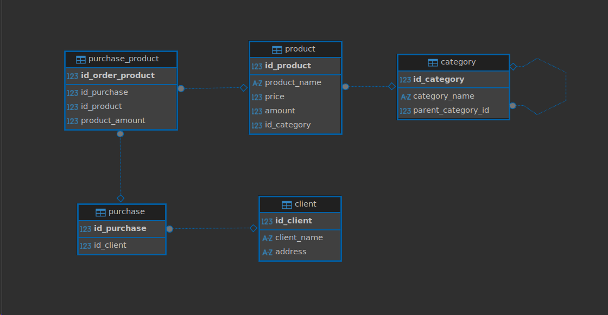

# Разработка схемы БД

Была разработана схема данных shop

## Сущности
- category

Описывает категорию товаров. Отвечает за древовидную структуру категорий
за счет добавления атрибута parent_category_id. Такая структура позволяет свободно редактировать связи 
и находить нужные при любой вложенности структуры.

- product

Описывает товар (цена, наименование стоимость)

- client

Содержит информацию о клиенте.

- purchase

Содержит информацию о заказе клиента - связь 1 к 1 (можно также добавить справочные атрибуты, 
например дата заказа или его статус, если добавить сущность статус заказа)

Также создана интеграционная таблица purchase_product для отображения связи между заказом и товаром.
Это необходимо так как тип связи - многие ко многим.

## Диаграмма схемы
